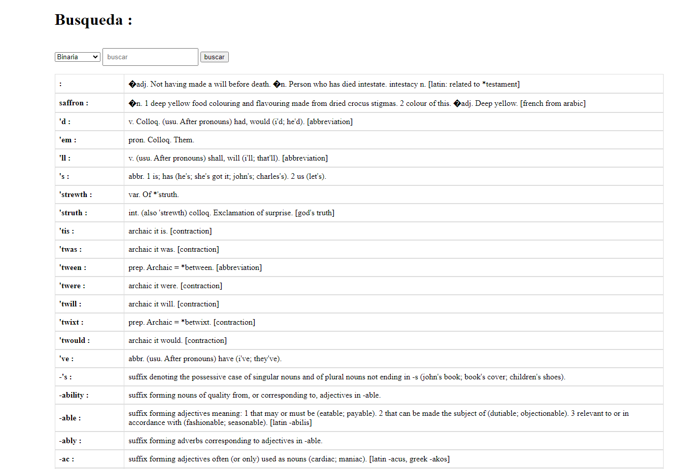

# Algoritmos de búsqueda secuencial y binaria



## Instrucciones de Configuración
1. **Clonar la aplicación**
    ````
    git clone https://github.com/DAndersonBurga/AlgoritmosBusquedas.git
    ````
2. **Construye y arranca la aplicación usando maven.**
    ````
    mvn clean package
    java -jar target/AlgoritmosBusquedas-1.0-SNAPSHOT.jar
    ````
    Alternativamente, puedes arrancar la aplicación sin empaquetarla usando:
    ```
    mvn spring-boot:run
    ````
    La aplicación empezará a ejecutarse en: http://localhost:8080